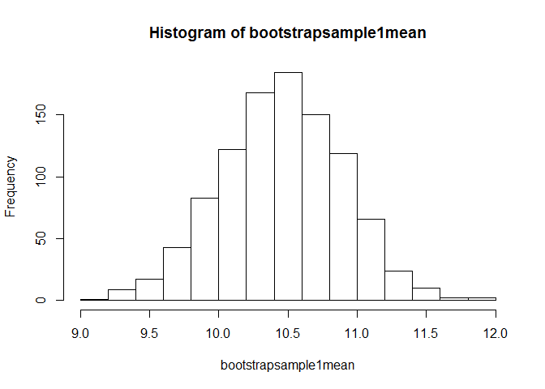
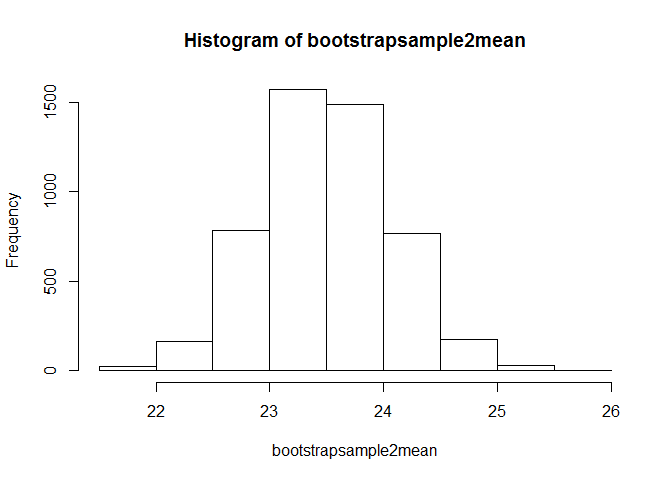
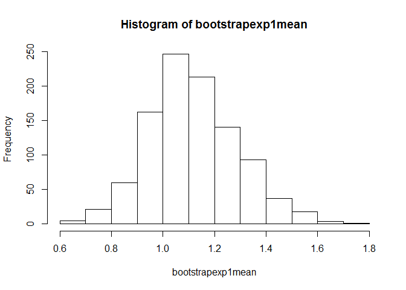
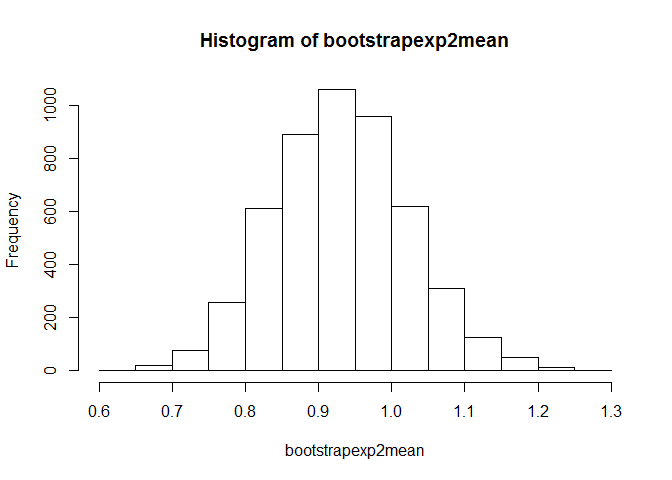

# Unit 4 HW - Bootstrap
Sandhya Amaresh  
June 8, 2016  

Bootstrap code to illustrate central limit theorem.
1st Using Normal distribution


```r
###First random normal distribution with mean 10, and sd = 4
x1 <- rnorm(50,mean=10,sd=3)
xm1 <- mean(x1)
###Mean of the normal distribution
xm1
```

```
## [1] 10.44308
```

```r
xsd1 <- sd(x1)
###Std deviation of the normal distribution
xsd1
```

```
## [1] 3.156015
```

```r
nsamples1 <- 1000
bootstrapsample1mean <- numeric(nsamples1)
bootstrapsample1sd <- numeric(nsamples1)
for(i in 1:nsamples1){
bootstrapsample1 <- sample (x1,50,replace=TRUE)
bootstrapsample1mean[i] <- mean(bootstrapsample1) 
bootstrapsample1sd[i] <- sd(bootstrapsample1)
}
###Mean of Samples
mean(bootstrapsample1)
```

```
## [1] 9.675597
```

```r
###Standard Deviation of Samples
sd(bootstrapsample1)
```

```
## [1] 3.483183
```

```r
#Summary of Samples
summary(bootstrapsample1)
```

```
##    Min. 1st Qu.  Median    Mean 3rd Qu.    Max. 
##   4.235   6.862   9.467   9.676  11.780  17.280
```

```r
#to demonstrate central limit theorem with the histogram plot
hist(bootstrapsample1mean)
```

<!-- -->


```r
###Second random normal distribution with mean 23, and sd = 5
x2 <- rnorm(100,mean=23,sd=5)
xm2 <- mean(x2)
xsd2 <- sd(x2)
###Mean of the normal distribution
xm2
```

```
## [1] 23.44201
```

```r
###Std deviation of the normal distribution
xsd2
```

```
## [1] 5.023059
```

```r
nsamples2 <- 5000
bootstrapsample2mean <- numeric(nsamples2)
bootstrapsample2sd <- numeric(nsamples2)
for(i in 1:nsamples2){
bootstrapsample2 <- sample (x2,100,replace=TRUE)
bootstrapsample2mean[i] <- mean(bootstrapsample2) 
bootstrapsample2sd[i] <- sd(bootstrapsample2)
}
###Mean of Sample 2
mean(bootstrapsample2)
```

```
## [1] 23.52811
```

```r
###Std deviation of Sample2
sd(bootstrapsample2)
```

```
## [1] 5.122901
```

```r
###Summary of sample 2
summary(bootstrapsample1)
```

```
##    Min. 1st Qu.  Median    Mean 3rd Qu.    Max. 
##   4.235   6.862   9.467   9.676  11.780  17.280
```

```r
#to demonstrate central limit theorem with the histogram plot
hist(bootstrapsample2mean)
```

<!-- -->
Bootstrap code to illustrate central limit theorem.
2nd Using Exponetial distribution


```r
###First exponential distribution with rate = 2
xexp1 <- rexp(50)
xexpm1 <- mean(xexp1)
###Mean of the normal distribution
xexpm1
```

```
## [1] 1.173227
```

```r
xexpsd1 <- sd(xexp1)
###Std deviation of the normal distribution
xsd1
```

```
## [1] 3.156015
```

```r
nsamples1 <- 1000
bootstrapexp1mean <- numeric(nsamples1)
bootstrapexp1sd <- numeric(nsamples1)
for(i in 1:nsamples1){
bootstrapexp1 <- sample (xexp1,50,replace=TRUE)
bootstrapexp1mean[i] <- mean(bootstrapexp1) 
bootstrapexp1sd[i] <- sd(bootstrapexp1)
}
###Mean of Samples
mean(bootstrapexp1)
```

```
## [1] 1.135062
```

```r
###Standard Deviation of Samples
sd(bootstrapexp1)
```

```
## [1] 0.9261619
```

```r
#Summary of Samples
summary(bootstrapexp1)
```

```
##    Min. 1st Qu.  Median    Mean 3rd Qu.    Max. 
## 0.02729 0.43970 0.77370 1.13500 1.87300 4.18200
```

```r
#to demonstrate central limit theorem with the histogram plot
hist(bootstrapexp1mean)
```

<!-- -->


```r
###Second exponential distribution 
xexp2 <- rexp(100)
xexpm2 <- mean(xexp2)
xexpsd2 <- sd(xexp2)
###Mean of the normal distribution
xexpm2
```

```
## [1] 1.053438
```

```r
###Std deviation of the normal distribution
xexpsd2
```

```
## [1] 1.000219
```

```r
nsamples2 <- 5000
bootstrapexp2mean <- numeric(nsamples2)
bootstrapexp2sd <- numeric(nsamples2)
for(i in 1:nsamples2){
bootstrapexp2 <- sample (xexp2,100,replace=TRUE)
bootstrapexp2mean[i] <- mean(bootstrapexp2) 
bootstrapexp2sd[i] <- sd(bootstrapexp2)
}
###Mean of Sample 2
mean(bootstrapexp2)
```

```
## [1] 1.305055
```

```r
###Std deviation of Sample2
sd(bootstrapexp2)
```

```
## [1] 1.336068
```

```r
###Summary of sample 2
summary(bootstrapexp2)
```

```
##     Min.  1st Qu.   Median     Mean  3rd Qu.     Max. 
## 0.007073 0.462200 0.776800 1.305000 1.748000 5.162000
```

```r
#to demonstrate central limit theorem with the histogram plot
hist(bootstrapexp2mean)
```

<!-- -->
