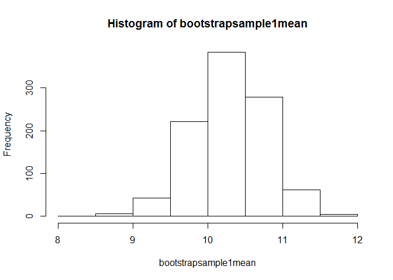

# Unit 4 HW - Bootstrap
Sandhya Amaresh  
June 8, 2016  

Bootstrap code to illustrate central limit theorem.
1st Using Normal distribution


```r
###First random normal distribution with mean 10, and sd = 4
x1 <- rnorm(50,mean=10,sd=3)
xm1 <- mean(x1)
###Mean of the normal distribution
xm1
```

```
## [1] 10.26382
```

```r
xsd1 <- sd(x1)
###Std deviation of the normal distribution
xsd1
```

```
## [1] 3.359482
```

```r
nsamples1 <- 1000
bootstrapsample1mean <- numeric(nsamples1)
bootstrapsample1sd <- numeric(nsamples1)
for(i in 1:nsamples1){
bootstrapsample1 <- sample (x1,50,replace=TRUE)
bootstrapsample1mean[i] <- mean(bootstrapsample1) 
bootstrapsample1sd[i] <- sd(bootstrapsample1)
}
###Mean of Samples
mean(bootstrapsample1mean)
```

```
## [1] 10.28866
```

```r
#Summary of Samples
summary(bootstrapsample1mean)
```

```
##    Min. 1st Qu.  Median    Mean 3rd Qu.    Max. 
##   8.497   9.970  10.300  10.290  10.630  11.600
```

```r
#to demonstrate central limit theorem with the histogram plot
hist(bootstrapsample1mean)
```

<!-- -->


```r
###Second random normal distribution with mean 23, and sd = 5
x2 <- rnorm(100,mean=23,sd=5)
xm2 <- mean(x2)
xsd2 <- sd(x2)
###Mean of the normal distribution
xm2
```

```
## [1] 23.49958
```

```r
###Std deviation of the normal distribution
xsd2
```

```
## [1] 5.839571
```

```r
nsamples2 <- 5000
bootstrapsample2mean <- numeric(nsamples2)
bootstrapsample2sd <- numeric(nsamples2)
for(i in 1:nsamples2){
bootstrapsample2 <- sample (x2,100,replace=TRUE)
bootstrapsample2mean[i] <- mean(bootstrapsample2) 
bootstrapsample2sd[i] <- sd(bootstrapsample2)
}
###Mean of Sample 2
mean(bootstrapsample2mean)
```

```
## [1] 23.50002
```

```r
###Summary of sample 2
summary(bootstrapsample2mean)
```

```
##    Min. 1st Qu.  Median    Mean 3rd Qu.    Max. 
##   21.63   23.10   23.49   23.50   23.88   25.81
```

```r
#to demonstrate central limit theorem with the histogram plot
hist(bootstrapsample2mean)
```

<!-- -->
Bootstrap code to illustrate central limit theorem.
2nd Using Exponetial distribution


```r
###First exponential distribution with rate = 2
xexp1 <- rexp(50)
xexpm1 <- mean(xexp1)
###Mean of the normal distribution
xexpm1
```

```
## [1] 1.122936
```

```r
xexpsd1 <- sd(xexp1)
###Std deviation of the normal distribution
xsd1
```

```
## [1] 3.359482
```

```r
nsamples1 <- 1000
bootstrapexp1mean <- numeric(nsamples1)
bootstrapexp1sd <- numeric(nsamples1)
for(i in 1:nsamples1){
bootstrapexp1 <- sample (xexp1,50,replace=TRUE)
bootstrapexp1mean[i] <- mean(bootstrapexp1) 
bootstrapexp1sd[i] <- sd(bootstrapexp1)
}
###Mean of Samples
mean(bootstrapexp1mean)
```

```
## [1] 1.116781
```

```r
#Summary of Samples
summary(bootstrapexp1mean)
```

```
##    Min. 1st Qu.  Median    Mean 3rd Qu.    Max. 
##  0.6612  1.0010  1.1030  1.1170  1.2250  1.7820
```

```r
#to demonstrate central limit theorem with the histogram plot
hist(bootstrapexp1mean)
```

<!-- -->


```r
###Second exponential distribution 
xexp2 <- rexp(100)
xexpm2 <- mean(xexp2)
###Mean of the normal distribution
xexpm2
```

```
## [1] 0.9331859
```

```r
nsamples2 <- 5000
bootstrapexp2mean <- numeric(nsamples2)
bootstrapexp2sd <- numeric(nsamples2)
for(i in 1:nsamples2){
bootstrapexp2 <- sample (xexp2,100,replace=TRUE)
bootstrapexp2mean[i] <- mean(bootstrapexp2) 
}
###Mean of Sample 2
mean(bootstrapexp2mean)
```

```
## [1] 0.932183
```

```r
###Summary of sample 2
summary(bootstrapexp2mean)
```

```
##    Min. 1st Qu.  Median    Mean 3rd Qu.    Max. 
##  0.6374  0.8671  0.9304  0.9322  0.9921  1.2700
```

```r
#to demonstrate central limit theorem with the histogram plot
hist(bootstrapexp2mean)
```

<!-- -->
